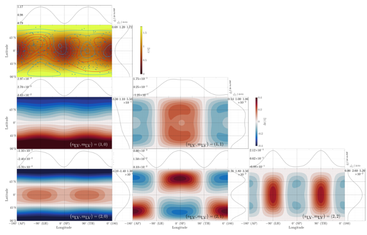

# LOV3D

[](https://matlab.mathworks.com/open/github/v1?repo=mroviranavarro/LOV3D_open)

[](https://opensource.org/licenses/Apache-2.0)


**LOV3D** is a Matlab package for obtaining the tidal response of viscoelastic self-gravitating bodies with lateral variations of interior properties. For a given interior structure and tidal load, the software solves the mass conservation, momentum conservation and Poisson equations and computes the tidal Love numbers. This is done in the spectral domain as detailed in Rovira-Navarro et al. 2023.




## Requirements

The code runs with MATLAB R2023a. 
Ghostscript is required if the user wants to store plots in pdf format.
The code uses the following third-party libraries: 

- [cmocean](https://github.com/chadagreene/cmocean): Thyng, Kristen, et al. “True Colors of Oceanography: Guidelines for Effective and Accurate Colormap Selection.” Oceanography, vol. 29, no. 3, The Oceanography Society, Sept. 2016, pp. 9–13, doi:10.5670/oceanog.2016.66.  
- [M_Map](www.eoas.ubc.ca/~rich/map.html): Pawlowicz, R., 2020. "M_Map: A mapping package for MATLAB", version 1.4m, [Computer software], available online at www.eoas.ubc.ca/~rich/map.html.  
- [export_fig](https://github.com/altmany/export_fig/releases/tag/v3.40): Yair Altman (2023). export_fig (https://github.com/altmany/export_fig/releases/tag/v3.40), GitHub. Retrieved November 21, 2023.  
- [harmonicY](https://www.mathworks.com/matlabcentral/fileexchange/74069-wigner-3j-6j-9j): Javier Montalt Tordera (2023). Spherical Harmonics, GitHub. Retrieved November 21, 2023. 
- [Wigner 3j-6j-9j](https://www.mathworks.com/matlabcentral/fileexchange/74069-wigner-3j-6j-9j): Vladimir Sovkov (2023). Wigner 3j-6j-9j, MATLAB Central File Exchange. Retrieved October 4, 2023.  


## Usage

A test-run that uses Io as an example can be found in ['example.m'](Scripts/example.m). When running the script `./Scripts/example.m` 14 figures will be generated. In addition to that, the following will be printed out in the command window of MATLAB:

```
Difference between energy computation with method 1 and 2 for the uniform model 0.056533 \%
Difference between energy computation with method 1 and 2 for a model with lateral variations 0.056538 \%
Tidal heating spherically-symmetric model 2.1341 W/m^2
Tidal heating laterally-heterogenous model 2.1917 W/m^2
```

See the manual in `./Docs` for information on inputs and outputs of the code.


## Structure 

In this repository you can find the following directories: 

```
.
├─── Docs
├─── Files_Coupling
├─── Files_Out
├─── Functions
│   ├─── Plot_Tools
│   │   ├─── altmany-export_fig-3
│   │   │   └─── resources
│   │   │       └─── project
│   │   │           ├─── Extensions.type.Root
│   │   │           │   └─── DependencyAnalysis.type.Extension
│   │   │           ├─── Root.type.Categories
│   │   │           │   └─── FileClassCategory.type.Category
│   │   │           ├─── Root.type.Files
│   │   │           └─── Root.type.ProjectPath
│   │   ├─── cmocean
│   │   │   └─── html
│   │   └─── m_map
│   │       ├─── doc
│   │       └─── private
│   └─── SPH_Tools
│       ├─── harmonicY
│       └─── Wigner
├─── LICENSES
├─── Plots_Out
├─── README.md
└─── Scripts

```


- ` Files_Coupling/` is where the coupling files used to compute the coupling coefficients are stored  
- ` Files_Out/` is where the output of the code is written  
- ` Functions/` contains the functions and subroutines used in the code    
- ` Scripts/` contains the example script (`example.m`) to run the code  
- ` Docs/` contains the manual   


## Documentation 

The theory behind the method is detailed in Rovira-Navarro et al. 2023. A manual can be found in ` Docs/`


## Author (s)

This software have been developed by: 

- **Marc Rovira-Navarro** :   [0000-0002-9980-5065] Conceptualization, methodology and software  
- **Isamu Matsuyama**:  [0000-0002-2917-8633] Conceptualization   
- **Allard Veenstra** software   


## License

The contents in the `docs/` directory together with all `png` files present in this repository are licensed under a **CC-BY 4.0** (see [CC-BY-4.0](LICENSES/CC-BY-4.0.txt) file). 

The source code, data files and example scripts are licensed under an **Apache License v2.0** (see [Apache-License-v2.0](LICENSES/Apache-License-v2.0.txt) file).

The following copyright notice is applicable to employees of Technische Universiteit Delft only (**Marc Rovira-Navarro** and **Allard Veenstra**):  

Copyright notice:

Technische Universiteit Delft hereby disclaims all copyright interest in the program “LOV3D”. LOV3D is a  Matlab package for obtaining the tidal response of bodies with lateral variations of interior properties by the Author(s).  
Henri Werij, Dean of Faculty of Aerospace Engineering, Technische Universiteit Delft.

&copy; 2023, M. Rovira-Navarro, I. Matsuyama, A. Veenstra

The code uses the following third party libraries:

Licenses and copyright statements for [cmocean](https://github.com/chadagreene/cmocean), [export_fig](https://github.com/altmany/export_fig/releases/tag/v3.40), [harmonicY](https://www.mathworks.com/matlabcentral/fileexchange/74069-wigner-3j-6j-9j) and [Wigner 3j-6j-9j]((https://www.mathworks.com/matlabcentral/fileexchange/74069-wigner-3j-6j-9j))  can be found in the [LICENSES](LICENSES/) folder.


## References

- (Rovira-Navarro, M., Matsuyama, I., Berne, A. 2023)[https://arxiv.org/abs/2311.15710]. A Spectral Method to Compute the Tides of Laterally-Heterogeneous Bodies. arXiv e-prints. doi:10.48550/arXiv.2311.15710
- Rovira-Navarro, M.,Matsuyama, I. & Berne, A., 2023 Revealing lateral structures in the interiors of planets and moons from tidal observations. AGU Fall Meeting Abstracts (2023).  
- (Rovira-Navarro, M. & Matsuyama, I. 2022)[https://ui.adsabs.harvard.edu/abs/2022AGUFM.P45E2514R/abstract]., A Spectral Method to Study the Tides of Laterally Heterogenous Bodies.  AGU Fall Meeting Abstracts.  


## Cite this repository 

If you use this software please cite it as:

- (Rovira-Navarro, M., Matsuyama, I., Berne, A. 2023)[https://arxiv.org/abs/2311.15710]. A Spectral Method to Compute the Tides of Laterally-Heterogeneous Bodies. arXiv e-prints. doi:10.48550/arXiv.2311.15710


## Would you like to contribute?

For questions and queries contact M. Rovira-Navarrro at m.roviranavarro@tudelft.nl


